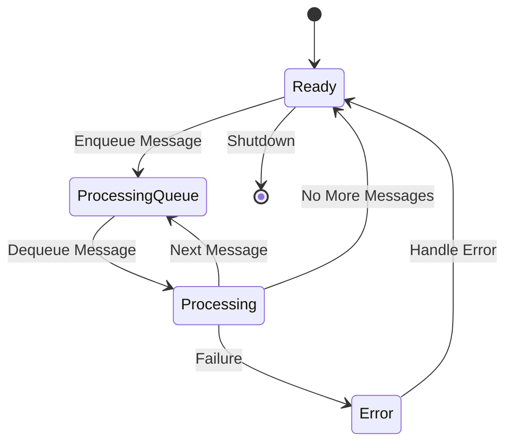

# Agent State Machine

An experiment for managing Large Language Model (LLM) agents using state machine patterns. This framework provides a robust and scalable foundation for building predictable, maintainable, and extensible AI agents.

> ⭐ If you find this project useful, please consider giving [Rig](https://github.com/0xPlaygrounds/rig) a star on GitHub.

## Why Use State Machines for LLM Agents?

### 1. **Predictable and Controlled Behavior**

- **Deterministic State Transitions**: The agent's behavior is governed by explicit states and transitions, ensuring consistency and predictability.
- **Defined Workflows**: Predefined paths guide the agent through complex tasks, reducing unexpected behaviors.
- **Error Handling and Recovery**: Structured error states allow for graceful recovery without compromising the overall system.

### 2. **Enhanced Debugging and Monitoring**

- **Observable States**: Track and log each state transition for real-time monitoring and historical analysis.
- **State History Tracking**: Maintain a record of state changes to diagnose issues and optimize performance.
- **Clear Entry and Exit Points**: Simplify debugging by isolating issues within specific states.

### 3. **Modular and Maintainable Code**

- **Separation of Concerns**: Each state encapsulates specific functionality, making the codebase modular.
- **Easy Extensibility**: Add or modify states and transitions without overhauling the entire system.
- **Isolated Testing**: Test states and transitions independently to ensure reliability.

### 4. **Asynchronous and Concurrent Processing**

- **Non-Blocking Operations**: Handle long-running tasks without blocking the main execution thread.
- **Queued Message Handling**: Process messages sequentially or concurrently, improving throughput.
- **Resource Optimization**: Efficiently manage resources like API calls, network connections, and memory.

### 5. **Fine-Grained Control Over Agent Behavior**

- **Customizable State Logic**: Tailor the agent's behavior by defining custom states and transitions.
- **Event-Driven Responses**: React to external events or user inputs dynamically within the state framework.
- **Advanced Workflow Management**: Implement complex behaviors like retries, timeouts, and conditional branching.

## Features

- 🔄 **Flexible State Management**: Define and manage custom states for your LLM agents.
- 📝 **Built-In Chat History Tracking**: Maintain conversation history effortlessly.
- 🔔 **State Change Notifications**: Subscribe to state changes for real-time monitoring.
- ❌ **Robust Error Handling**: Gracefully handle errors with clear recovery paths.
- 📚 **Tool Integration**: Seamlessly integrate with tools and APIs (e.g., arXiv API).
- 🌐 **Asynchronous Processing**: Efficiently handle long-running or queued tasks.
- 🔌 **Rig-Compatible**: Works with any [Rig](https://github.com/0xPlaygrounds/rig)-compatible LLM provider.

## Installation

Clone this repository and navigate to the `agent_state_machine` directory:

```bash
git clone https://github.com/0xPlaygrounds/awesome-rig.git
cd agent_state_machine
```

## Quick Start

```rust
use agent_state_machine::{ChatAgentStateMachine, AgentState};
use rig::providers::openai;

#[tokio::main]
async fn main() {
    // Initialize OpenAI client
    let client = openai::Client::from_env();

    // Create agent with GPT-4
    let agent = client
        .agent(openai::GPT_4)
        .preamble("You are a helpful AI assistant.")
        .build();

    // Create state machine
    let mut state_machine = ChatAgentStateMachine::new(agent);

    // Subscribe to state changes
    let mut state_rx = state_machine.subscribe_to_state_changes();

    // Monitor state changes
    tokio::spawn(async move {
        while let Ok(state) = state_rx.recv().await {
            println!("📍 State changed to: {}", state);
        }
    });

    // Set up a response callback
    state_machine.set_response_callback(|response| {
        println!("🤖 Assistant: {}", response);
    });

    // Process a message
    state_machine
        .process_message("Hello!")
        .await
        .unwrap();

    // Wait until processing is complete
    while state_machine.current_state() != &AgentState::Ready {
        tokio::time::sleep(std::time::Duration::from_millis(100)).await;
    }
}
```

## State Machine Diagram



## Current States

| State            | Description                                             |
|------------------|---------------------------------------------------------|
| **Ready**        | Agent is idle and ready to receive input                |
| **ProcessingQueue** | Agent is managing the message queue                    |
| **Processing**   | Agent is processing a message                           |
| **Error**        | Agent encountered an error during processing            |

## Future Extensions

This framework can be extended to support:

- 🛠 **Advanced Tool Integration**: Incorporate more complex tools with dedicated states.
- 💾 **Persistent Storage**: Implement persistent conversation history and state.
- 🔄 **Automatic Retries**: Add retry mechanisms for failed operations.
- 🎯 **Goal-Oriented Behavior**: Introduce goal-tracking and planning capabilities.
- 🔗 **Multi-Agent Coordination**: Coordinate behaviors among multiple agents.
- 🧠 **Context Management**: Manage context switching and parallel conversations.

## Example Use Cases

### 1. **Research Assistant**

Build an AI agent that searches academic databases (e.g., arXiv) and summarizes papers:

- **Queued Processing**: Handle multiple search results one by one.
- **Asynchronous Execution**: Fetch and process papers without blocking.
- **State Tracking**: Monitor progress through different processing stages.

### 2. **Customer Support Bot**

Develop a chatbot for customer service interactions:

- **Stateful Conversations**: Maintain context across multiple turns.
- **Error Handling**: Recover from misunderstandings or incorrect inputs.
- **Integration with APIs**: Interface with backend systems for data retrieval.

### 3. **Data Pipeline Automation**

Create an agent that automates data processing tasks:

- **Task Scheduling**: Manage and execute tasks based on state transitions.
- **Resource Management**: Allocate and release resources efficiently.
- **Monitoring and Logging**: Track the pipeline's progress and performance.

## Need to Know

- **Built with [Rig](https://github.com/0xPlaygrounds/rig)**: A Rust library for building LLM-powered applications.
- **Inspired by Traditional State Machines**: Apply proven software engineering patterns to AI agents.

---


# Examples

## Research Assistant Example

Check out `examples/research_assistant.rs` to see how to build a research assistant that searches arXiv and summarizes papers.

## Simple Chat Example

Refer to `examples/simple_chat.rs` for a basic implementation of a chat agent using the state machine.

---

**Note**: Ensure that your environment variables are set up correctly, such as the OpenAI API key required by `openai::Client::from_env()`.

⭐ If you find this project useful, please consider giving [Rig](https://github.com/0xPlaygrounds/rig) a star on GitHub.
