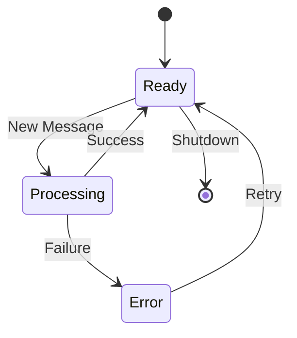

# Agent State Machine

A Rust implementation for managing Large Language Model (LLM) agents using state machine patterns. This template provides a robust framework for building predictable, maintainable, and scalable AI agents.

## Why State Machines for LLM Agents?

State machines provide several key advantages when building LLM-powered applications:

### 1. Predictable Behavior
- **Clear State Transitions**: Each agent can only be in one state at a time (e.g., Ready, Processing, Error)
- **Defined Workflows**: State transitions follow predefined paths, making behavior predictable
- **Error Recovery**: Clear paths for handling and recovering from error states

### 2. Easier Debugging
- **Observable States**: Each state transition is tracked and can be logged
- **State History**: Track how the agent moved through different states
- **Clear Entry/Exit Points**: Each state has clear conditions for entering and exiting

### 3. Maintainable Code
- **Separation of Concerns**: Each state handles specific responsibilities
- **Modular Design**: Easy to add new states or modify existing ones
- **Testable**: States and transitions can be tested in isolation

### 4. Enhanced Control
- **Resource Management**: Control resource allocation based on state
- **Rate Limiting**: Implement waiting states for API rate limits
- **Graceful Shutdown**: Ensure proper cleanup through state transitions

## Features

- 🔄 Simple state management for LLM agents
- 📝 Built-in chat history tracking
- 🔔 State change notifications
- ❌ Error handling and recovery
- 🔌 Works with any Rig-compatible LLM provider

## Installation

Simply clone this repo and open the agent_state_machine folder

## Quick Start

```rust
use agent_state_machine::ChatAgentStateMachine;
use rig::providers::openai;

#[tokio::main]
async fn main() {
    // Initialize OpenAI client
    let client = openai::Client::from_env();
    
    // Create agent with GPT-4
    let agent = client
        .agent(openai::GPT_4)
        .preamble("You are a helpful AI assistant.")
        .build();
    
    // Create state machine
    let mut state_machine = ChatAgentStateMachine::new(agent);
    
    // Subscribe to state changes
    let mut state_rx = state_machine.subscribe_to_state_changes();
    
    // Monitor state changes
    tokio::spawn(async move {
        while let Ok(state) = state_rx.recv().await {
            println!("State changed to: {}", state);
        }
    });
    
    // Process a message
    let response = state_machine
        .process_message("Hello!")
        .await
        .unwrap();
        
    println!("Response: {}", response);
}
```

## State Machine Diagram



## Current States

| State | Description |
|-------|-------------|
| Ready | Agent is waiting for input |
| Processing | Agent is handling a message |
| Error | An error occurred during processing |

## Future Extensions

This template can be extended to support:

- 🛠 Tool usage with dedicated tool states
- 💾 Persistent conversation history
- 🔄 Automatic retry mechanisms
- 🎯 Goal-oriented behavior tracking
- 🔗 Multi-agent coordination
- 🧠 Context management states

## Example Use Cases

1. **Customer Service Bots**
   - Track conversation state
   - Handle handoffs to human agents
   - Manage multiple conversation threads

2. **AI Researchers**
   - Track experimental states
   - Monitor model behavior
   - Log state transitions

3. **Tool-Using Agents**
   - Manage tool selection states
   - Handle tool execution
   - Process tool results


## Need to know

- This projec is built with [Rig](https://github.com/0xPlaygrounds/rig)
- Inspired by traditional state machine patterns in software engineering

---
⭐ If you find this project useful, please consider giving [Rig](https://github.com/0xPlaygrounds/rig) a star on github