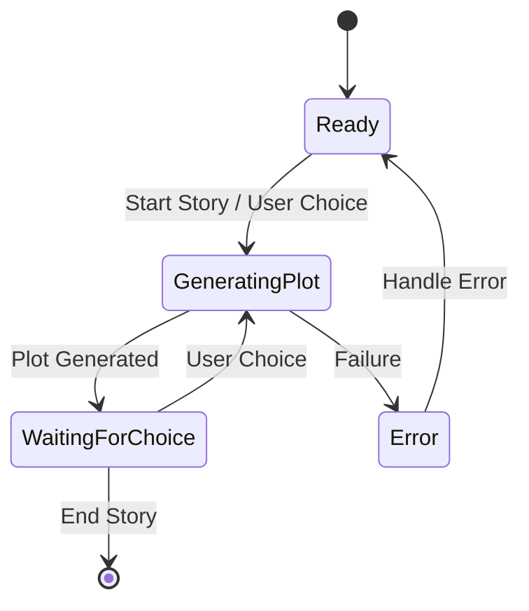
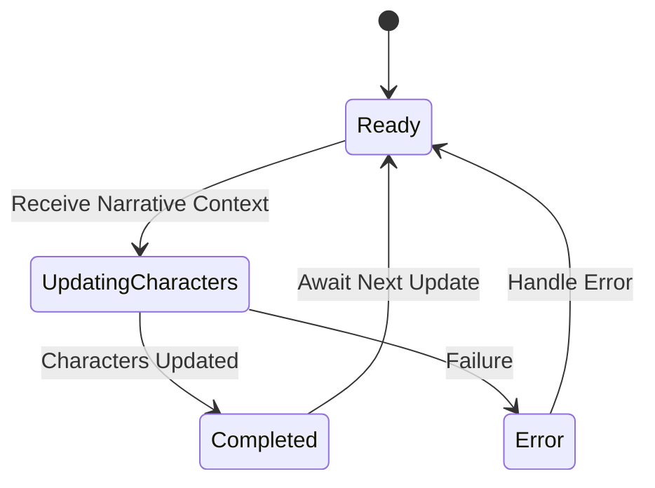
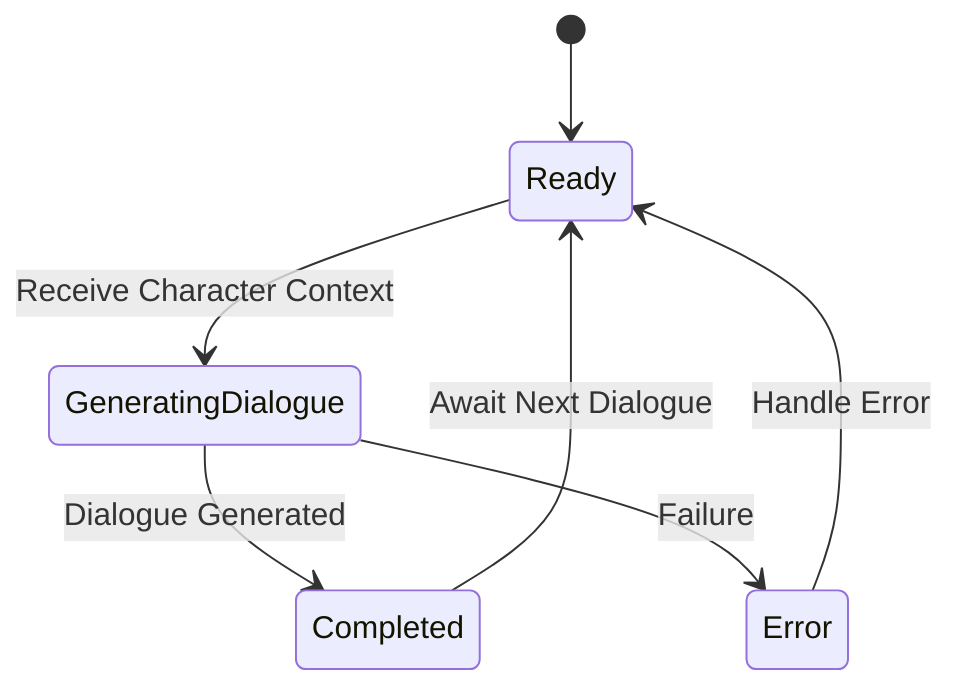
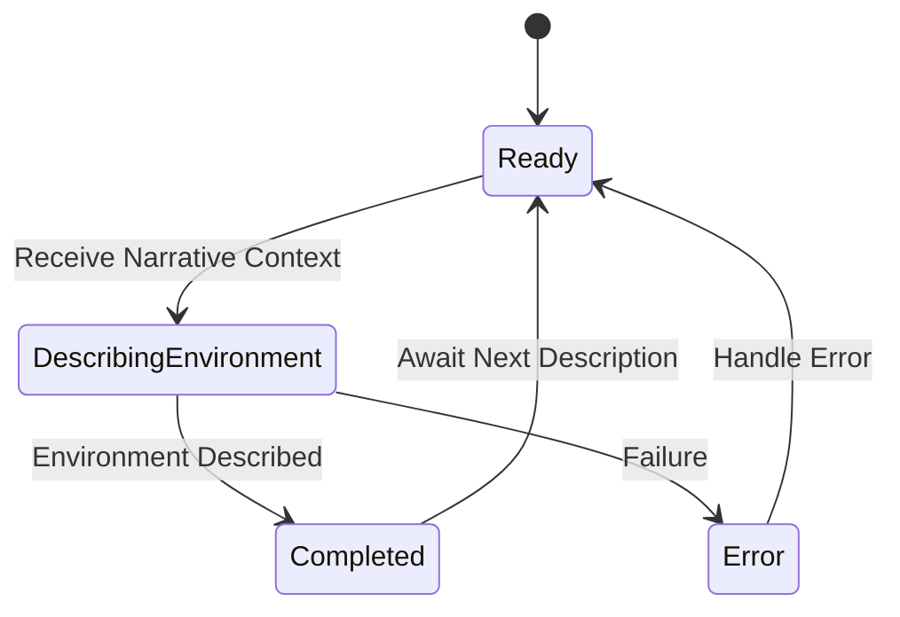
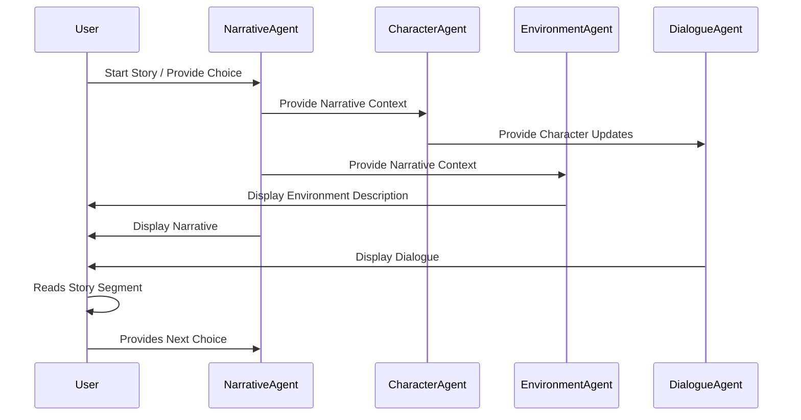

# Interactive Storytelling with Dynamic World Building and Content Generation

An example demonstrating how to build an interactive storytelling application using multiple AI agents and state machines in Rust, leveraging the [Agent State Machine](https://github.com/0xPlaygrounds/awesome-rig/tree/main/agent_state_machine) design pattern and [Rig](https://github.com/0xPlaygrounds/rig).

---

## Table of Contents

- [Interactive Storytelling with Dynamic World Building and Content Generation](#interactive-storytelling-with-dynamic-world-building-and-content-generation)
  - [Table of Contents](#table-of-contents)
  - [Overview](#overview)
  - [Agents and Their Roles](#agents-and-their-roles)
    - [1. **Narrative Agent**](#1-narrative-agent)
    - [2. **Character Agent**](#2-character-agent)
    - [3. **Dialogue Agent**](#3-dialogue-agent)
    - [4. **Environment Agent**](#4-environment-agent)
  - [State Machines and States](#state-machines-and-states)
    - [Narrative Agent State Machine](#narrative-agent-state-machine)
    - [Character Agent State Machine](#character-agent-state-machine)
    - [Dialogue Agent State Machine](#dialogue-agent-state-machine)
    - [Environment Agent State Machine](#environment-agent-state-machine)
  - [Mermaid Diagrams](#mermaid-diagrams)
    - [Overall Workflow](#overall-workflow)
  - [Implementation Details](#implementation-details)
    - [Project Structure](#project-structure)
    - [Code Breakdown](#code-breakdown)
      - [1. **Main Function (`main.rs`)**](#1-main-function-mainrs)
      - [2. **Agent Implementations**](#2-agent-implementations)
      - [3. **State Transitions**](#3-state-transitions)
      - [4. **User Interaction**](#4-user-interaction)
  - [Running the Example](#running-the-example)
    - [Prerequisites](#prerequisites)
    - [Setup](#setup)
    - [Execution](#execution)
  - [Interacting with the Story](#interacting-with-the-story)
  - [Next updates](#next-updates)
  - [Conclusion](#conclusion)

---

## Overview

This example demonstrates how to create an interactive storytelling application by chaining multiple agents, each managed by its own state machine. The agents collaborate to generate a dynamic story that evolves based on user input.

**Key Concepts:**

- **Modularity**: Each agent focuses on a specific aspect of the story.
- **State Machines**: Manage the states and transitions of each agent for predictable behavior.
- **Asynchronous Execution**: Agents operate asynchronously, ensuring efficient resource utilization.
- **User Interaction**: The user's choices directly influence the narrative progression.

---

## Agents and Their Roles

### 1. **Narrative Agent**

- **Role**: Crafts the overarching storyline and plot progression.
- **Responsibilities**:
  - Initiates the story.
  - Updates the plot based on user choices.
- **Inputs**: User choices, previous plot points.
- **Outputs**: Story events, plot advancements.

### 2. **Character Agent**

- **Role**: Develops characters, their backgrounds, and personalities.
- **Responsibilities**:
  - Updates character states based on the narrative.
  - Manages character development and interactions.
- **Inputs**: Narrative context.
- **Outputs**: Character states and actions.

### 3. **Dialogue Agent**

- **Role**: Generates dialogues between characters.
- **Responsibilities**:
  - Creates conversational exchanges that fit the current context.
- **Inputs**: Character context.
- **Outputs**: Dialogues between characters.

### 4. **Environment Agent**

- **Role**: Describes settings and environments vividly.
- **Responsibilities**:
  - Provides atmospheric descriptions to enhance immersion.
- **Inputs**: Narrative context.
- **Outputs**: Environmental descriptions.

---

## State Machines and States

### Narrative Agent State Machine



**States:**

- **Ready**: Awaiting story initiation or user input.
- **GeneratingPlot**: Crafting the next part of the story.
- **WaitingForChoice**: Awaiting user decision to influence the plot.
- **Error**: An error occurred during plot generation.

### Character Agent State Machine



**States:**

- **Ready**: Waiting for narrative context.
- **UpdatingCharacters**: Adjusting character states based on the narrative.
- **Completed**: Character updates are complete.
- **Error**: An error occurred during character update.

### Dialogue Agent State Machine



**States:**

- **Ready**: Waiting for character context.
- **GeneratingDialogue**: Creating dialogues between characters.
- **Completed**: Dialogue generation is complete.
- **Error**: An error occurred during dialogue generation.

### Environment Agent State Machine



**States:**

- **Ready**: Waiting for narrative context.
- **DescribingEnvironment**: Generating environmental descriptions.
- **Completed**: Environment description is complete.
- **Error**: An error occurred during environment description.

---

## Mermaid Diagrams

### Overall Workflow



---

## Implementation Details

### Project Structure

```
agent_state_machine/
├── Cargo.lock
├── Cargo.toml
├── README.md
├── examples
│   ├── arxiv_test.rs
│   ├── research_assistant.rs
│   ├── serpapi_test.rs
│   ├── simple_chat.rs
│   └── interactive_storytelling/
│       ├── main.rs
│       ├── narrative_agent.rs
│       ├── character_agent.rs
│       ├── dialogue_agent.rs
│       └── environment_agent.rs
└── src
    ├── lib.rs
    ├── machine.rs
    └── state.rs
```

### Code Breakdown

#### 1. **Main Function (`main.rs`)**

Located at `examples/interactive_storytelling/main.rs`, the main function coordinates the agents and handles user interaction.

- **Imports Modules**: Imports the agent modules.
- **Initializes Agents**: Creates instances of each agent with their respective preambles.
- **Story Loop**: Contains a loop that:
  - Generates the plot.
  - Updates characters.
  - Describes the environment.
  - Generates dialogues.
  - Displays the combined story segment.
  - Prompts the user for the next action.

#### 2. **Agent Implementations**

Each agent is defined in its own file within the `interactive_storytelling` directory.

- **`narrative_agent.rs`**
  - Contains the `NarrativeAgent` struct and implementation.
  - Method: `generate_plot`.

- **`character_agent.rs`**
  - Contains the `CharacterAgent` struct and implementation.
  - Method: `update_characters`.

- **`dialogue_agent.rs`**
  - Contains the `DialogueAgent` struct and implementation.
  - Method: `generate_dialogue`.

- **`environment_agent.rs`**
  - Contains the `EnvironmentAgent` struct and implementation.
  - Method: `describe_environment`.

All agents utilize the `ChatAgentStateMachine` from the `agent_state_machine` library.

#### 3. **State Transitions**

Agents use the `transition_to` method to move between states, ensuring predictable behavior and facilitating debugging.

#### 4. **User Interaction**

The main function handles user input using asynchronous I/O:

- Uses `tokio::io` to read user input.
- The user's choices are passed to the `NarrativeAgent` to influence the story.

---

## Running the Example

### Prerequisites

- **Rust**: Ensure you have Rust installed. Install it from [rustup.rs](https://rustup.rs/).
- **OpenAI API Key**: You need an OpenAI API key to use GPT-4. Set it as an environment variable:

  ```bash
  export OPENAI_API_KEY=your_openai_api_key
  ```

### Setup

1. **Clone the Repository**:

   ```bash
   git clone https://github.com/0xPlaygrounds/awesome-rig.git
   cd agent_state_machine
   ```

2. **Update Dependencies**:

   Ensure your `Cargo.toml` includes the necessary dependencies:

   ```toml
   [dependencies]
   agent_state_machine = { path = "." }
   rig-core = "0.2"
   tokio = { version = "1", features = ["full"] }
   ```

### Execution

Run the interactive storytelling example:

```bash
cargo run --example interactive_storytelling
```

---

## Interacting with the Story

1. **Start the Application**:

   Upon running, the application initializes the agents and begins the story.

2. **Read the Initial Story Segment**:

   The agents generate the opening narrative, character introductions, environment descriptions, and dialogues.

3. **Provide Input**:

   When prompted with:

   ```
   What do you want to do next?
   ```

   Type your desired action and press `Enter`.

   **Example**:

   ```
   > Venture deeper into the forest in search of the mysterious voice.
   ```

4. **Continue the Story**:

   The agents process your input and generate the next segment of the story.

5. **End the Story**:

   To conclude the session, press `Enter` without typing any input when prompted.

---

## Next updates

- **Enhance Agent Preambles**: Fine-tune the behavior of each agent by adjusting their preambles.

- **Add New Agents**: Introduce additional agents for more complexity, such as an `ActionAgent` or `EmotionAgent`.

- **Improve Error Handling**: Implement robust error handling and logging mechanisms.

- **Develop a GUI**: Create a graphical interface for a better user experience.

- **Persist Story State**: Save the story progression to allow users to resume later.

---

## Conclusion

This example showcases how to build a complex application by chaining multiple agents, each managed by their own state machine. The modular design allows for easy maintenance and scalability, while the state machines ensure predictable and manageable behavior.


**Happy storytelling!** If you have any questions or need assistance or want to work together, feel free to reach out.